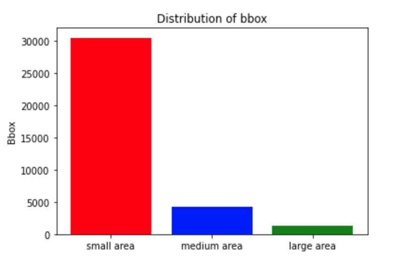
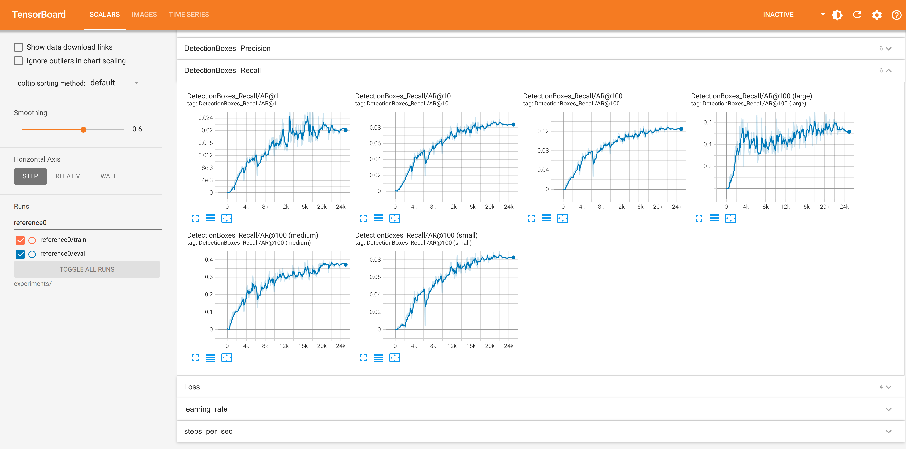

# Object Detection in an Urban Environment

## Data

For this project, we will be using data from the [Waymo Open dataset](https://waymo.com/open/).

[OPTIONAL] - The files can be downloaded directly from the website as tar files or from the [Google Cloud Bucket](https://console.cloud.google.com/storage/browser/waymo_open_dataset_v_1_2_0_individual_files/) as individual tf records. We have already provided the data required to finish this project in the workspace, so you don't need to download it separately.

## Structure

### Data

The data you will use for training, validation and testing is organized as follow:
```
/home/workspace/data/waymo
    - training_and_validation - contains 97 files to train and validate your models
    - train: contain the train data (empty to start)
    - val: contain the val data (empty to start)
    - test - contains 3 files to test your model and create inference videos
```

The `training_and_validation` folder contains file that have been downsampled: we have selected one every 10 frames from 10 fps videos. The `testing` folder contains frames from the 10 fps video without downsampling.

You will split this `training_and_validation` data into `train`, and `val` sets by completing and executing the `create_splits.py` file.

### Experiments
The experiments folder will be organized as follow:
```
experiments/
    - pretrained_model/
    - exporter_main_v2.py - to create an inference model
    - model_main_tf2.py - to launch training
    - reference/ - reference training with the unchanged config file
    - experiment0/ - create a new folder for each experiment you run
    - experiment1/ - create a new folder for each experiment you run
    - experiment2/ - create a new folder for each experiment you run
    - label_map.pbtxt
    ...
```

## Prerequisites

### Local Setup

For local setup if you have your own Nvidia GPU, you can use the provided Dockerfile and requirements in the [build directory](./build).

Follow [the README therein](./build/README.md) to create a docker container and install all prerequisites.

### Download and process the data

**Note:** ”If you are using the classroom workspace, we have already completed the steps in the section for you. You can find the downloaded and processed files within the `/home/workspace/data/preprocessed_data/` directory. Check this out then proceed to the **Exploratory Data Analysis** part.

The first goal of this project is to download the data from the Waymo's Google Cloud bucket to your local machine. For this project, we only need a subset of the data provided (for example, we do not need to use the Lidar data). Therefore, we are going to download and trim immediately each file. In `download_process.py`, you can view the `create_tf_example` function, which will perform this processing. This function takes the components of a Waymo Tf record and saves them in the Tf Object Detection api format. An example of such function is described [here](https://tensorflow-object-detection-api-tutorial.readthedocs.io/en/latest/training.html#create-tensorflow-records). We are already providing the `label_map.pbtxt` file.

You can run the script using the following command:
```
python download_process.py --data_dir {processed_file_location} --size {number of files you want to download}
```

You are downloading 100 files (unless you changed the `size` parameter) so be patient! Once the script is done, you can look inside your `data_dir` folder to see if the files have been downloaded and processed correctly.

### Classroom Workspace

In the classroom workspace, every library and package should already be installed in your environment. You will NOT need to make use of `gcloud` to download the images.

## Instructions

### Exploratory Data Analysis

You should use the data already present in `/home/workspace/data/waymo` directory to explore the dataset! This is the most important task of any machine learning project. To do so, open the `Exploratory Data Analysis` notebook. In this notebook, your first task will be to implement a `display_instances` function to display images and annotations using `matplotlib`. This should be very similar to the function you created during the course. Once you are done, feel free to spend more time exploring the data and report your findings. Report anything relevant about the dataset in the writeup.

Keep in mind that you should refer to this analysis to create the different spits (training, testing and validation).


### Create the training - validation splits
In the class, we talked about cross-validation and the importance of creating meaningful training and validation splits. For this project, you will have to create your own training and validation sets using the files located in `/home/workspace/data/waymo`. The `split` function in the `create_splits.py` file does the following:
* create three subfolders: `/home/workspace/data/train/`, `/home/workspace/data/val/`, and `/home/workspace/data/test/`
* split the tf records files between these three folders by symbolically linking the files from `/home/workspace/data/waymo/` to `/home/workspace/data/train/`, `/home/workspace/data/val/`, and `/home/workspace/data/test/`

Use the following command to run the script once your function is implemented:
```
python create_splits.py --data-dir /home/workspace/data
```

### Edit the config file

Now you are ready for training. As we explain during the course, the Tf Object Detection API relies on **config files**. The config that we will use for this project is `pipeline.config`, which is the config for a SSD Resnet 50 640x640 model. You can learn more about the Single Shot Detector [here](https://arxiv.org/pdf/1512.02325.pdf).

First, let's download the [pretrained model](http://download.tensorflow.org/models/object_detection/tf2/20200711/ssd_resnet50_v1_fpn_640x640_coco17_tpu-8.tar.gz) and move it to `/home/workspace/experiments/pretrained_model/`.

We need to edit the config files to change the location of the training and validation files, as well as the location of the label_map file, pretrained weights. We also need to adjust the batch size. To do so, run the following:
```
python edit_config.py --train_dir /home/workspace/data/train/ --eval_dir /home/workspace/data/val/ --batch_size 2 --checkpoint /home/workspace/experiments/pretrained_model/ssd_resnet50_v1_fpn_640x640_coco17_tpu-8/checkpoint/ckpt-0 --label_map /home/workspace/experiments/label_map.pbtxt
```
A new config file has been created, `pipeline_new.config`.

### Training

You will now launch your very first experiment with the Tensorflow object detection API. Move the `pipeline_new.config` to the `/home/workspace/experiments/reference` folder. Now launch the training process:
* a training process:
```
python experiments/model_main_tf2.py --model_dir=experiments/reference/ --pipeline_config_path=experiments/reference/pipeline_new.config
```
Once the training is finished, launch the evaluation process:
* an evaluation process:
```
python experiments/model_main_tf2.py --model_dir=experiments/reference/ --pipeline_config_path=experiments/reference/pipeline_new.config --checkpoint_dir=experiments/reference/
```

**Note**: Both processes will display some Tensorflow warnings, which can be ignored. You may have to kill the evaluation script manually using
`CTRL+C`.

To monitor the training, you can launch a tensorboard instance by running `python -m tensorboard.main --logdir experiments/reference/`. You will report your findings in the writeup.

### Improve the performances

Most likely, this initial experiment did not yield optimal results. However, you can make multiple changes to the config file to improve this model. One obvious change consists in improving the data augmentation strategy. The [`preprocessor.proto`](https://github.com/tensorflow/models/blob/master/research/object_detection/protos/preprocessor.proto) file contains the different data augmentation method available in the Tf Object Detection API. To help you visualize these augmentations, we are providing a notebook: `Explore augmentations.ipynb`. Using this notebook, try different data augmentation combinations and select the one you think is optimal for our dataset. Justify your choices in the writeup.

Keep in mind that the following are also available:
* experiment with the optimizer: type of optimizer, learning rate, scheduler etc
* experiment with the architecture. The Tf Object Detection API [model zoo](https://github.com/tensorflow/models/blob/master/research/object_detection/g3doc/tf2_detection_zoo.md) offers many architectures. Keep in mind that the `pipeline.config` file is unique for each architecture and you will have to edit it.

**Important:** If you are working on the workspace, your storage is limited. You may to delete the checkpoints files after each experiment. You should however keep the `tf.events` files located in the `train` and `eval` folder of your experiments. You can also keep the `saved_model` folder to create your videos.


### Creating an animation
#### Export the trained model
Modify the arguments of the following function to adjust it to your models:

```
python experiments/exporter_main_v2.py --input_type image_tensor --pipeline_config_path experiments/reference/pipeline_new.config --trained_checkpoint_dir experiments/reference/ --output_directory experiments/reference/exported/
```

This should create a new folder `experiments/reference/exported/saved_model`. You can read more about the Tensorflow SavedModel format [here](https://www.tensorflow.org/guide/saved_model).

Finally, you can create a video of your model's inferences for any tf record file. To do so, run the following command (modify it to your files):
```
python inference_video.py --labelmap_path label_map.pbtxt --model_path experiments/reference/exported/saved_model --tf_record_path /data/waymo/testing/segment-12200383401366682847_2552_140_2572_140_with_camera_labels.tfrecord --config_path experiments/reference/pipeline_new.config --output_path animation.gif
```

## Submission Template

### Project overview

Self-driving cars must be able to sense objects around them in order to move safely and successfully. With object detection algorithms, it can be provided to detect objects around and even objects belonging to pedestrian, cyclist, vehicle, etc. class from the images to be obtained from the vehicle camera. Real-time object detection models to be used for this purpose should be trained previously, model performance should be evaluated, and the model should be generalized.

In this first project of the [Udacity Self Driving Car Engineer Nanodegree program](https://www.udacity.com/course/self-driving-car-engineer-nanodegree--nd0013), an object detection model that can detect pedestrians, cyclists and vehicles has been developed using the [Waymo Open dataset](https://waymo.com/open/) and [TensorFlow Object Detection API
](https://github.com/tensorflow/models/tree/master/research/object_detection).

### Set up

After cloning this repository, the following commands are run to create a docker container.
```
docker build -t project-dev -f Dockerfile .

docker run --gpus all -v <PATH TO LOCAL PROJECT FOLDER>:/app/project/ -p <local machine port for jupyter-notebook>:8888 -p <local machine port for tensorboard>:6006 --network=host -ti project-dev bash

```
Once in container, you will need to install gsutil, which you can easily do by running:

```
curl https://sdk.cloud.google.com | bash
```

Once gsutil is installed and added to your path, you can auth using:

```
gcloud auth login
```

This work was done on the local machine and two Nvidia GPU were used, one for training and the other for evaluation.

Before running the training or evaluation codes in the terminal, the gpu must be assigned by running the following command.

```
CUDA_VISIBLE_DEVICES= device_id # 0,1 etc.
```

### Dataset
#### Dataset analysis
The waymo dataset consists of 5 classes: unknown, vehicle, pedestrian, sign and cyclist. Vehicle, pedestrian, and cyclist classes are used in this project.

Images in dataset containing examples from each class are shown below. Vehicle is visualized in red, pedestrian in blue and cyclist in green.


 

Dataset analysis is performed on 10000 random images in [Exploratory Data Analysis](ExploratoryDataAnalysis.ipynb) file. The class distribution of the bboxes in the Dataset, the distribution of the number of bboxes in an image and the distribution of the bbox area sizes are visualized as follows.

  

In the [cocoeval](https://github.com/cocodataset/cocoapi/blob/master/PythonAPI/pycocotools/cocoeval.py) file, object area ranges for evaluation and thresholds on max detections per image are determined as follows. Therefore, these values are taken as a basis when analyzing small, normal (medium) and large bbox areas and analyzing bbox numbers in an image.

```
self.maxDets = [1, 10, 100]
self.areaRng = [[0 ** 2, 1e5 ** 2], [0 ** 2, 32 ** 2], [32 ** 2, 96 ** 2], [96 ** 2, 1e5 ** 2]]
self.areaRngLbl = ['all', 'small', 'medium', 'large']
```
According to the analysis, there are no images containing more than the maximum number of detections and large part of the objects are small objects..
#### Cross validation

The dataset contains 100 tfrecord files for training, validation and testing. To reduce the imbalance of classes, the dataset was randomly shuffled and split into training, validation, and testing datasets. After the model was trained on the training dataset and evaluated on the validation dataset, the final model was recorded and tested on the test data. 

The dataset distribution is as below.


### Training
#### Reference experiment

Before starting the training, the following operations should be performed in order to visualize the class-based precision metrics on the tensorboard.

1. The following codes should be added to line 497 in the [cocoeval.py](https://github.com/cocodataset/cocoapi/blob/master/PythonAPI/pycocotools/cocoeval.py) file.

```
def summarize_per_category(self):
        '''
        Compute and display summary metrics for evaluation results per category.
        '''
        def _summarize_single_category(ap=1, iouThr=None, categoryId=None, areaRng='all', maxDets=100):
            p = self.params
            aind = [i for i, aRng in enumerate(p.areaRngLbl) if aRng == areaRng]
            mind = [i for i, mDet in enumerate(p.maxDets) if mDet == maxDets]
            s = self.eval['precision']
            category_index = [i for i, i_catId in enumerate(p.catIds) if i_catId == categoryId]
            s = s[:,:,category_index,aind,mind]
        
            if len(s[s>-1])==0:
                mean_s = -1
            else:
                mean_s = np.mean(s[s>-1])
            return mean_s

        def summarizeDets_per_category():
            category_stats = np.zeros((1,len(self.params.catIds)))
            for category_index, category_id in enumerate(self.params.catIds):
                category_stats[0][category_index] = _summarize_single_category(1,categoryId=category_id)
           
            return category_stats

        if not self.eval:
            raise Exception('Please run accumulate() first')
        
        summarize_per_category = _summarizeDets_per_category
        
        self.category_stats = summarize_per_category()

    def __str__(self):
        self.summarize_per_category()
```
2. The following codes should be added to line 288 in the [coco_tools.py](https://github.com/tensorflow/models/blob/master/research/object_detection/metrics/coco_tools.py) file.

```
    if include_metrics_per_category is True:
        self.summarize_per_category()
```

3. The following lines should be added to the pipeline_new.config file.

```
{
  metrics_set: "coco_detection_metrics" 
  include_metrics_per_category: true 
}
```

Resnet model  is configured with randomly cropping images and horizatal flip is trained with the batch size of 8. Training and evaluation were performed according to the reference configuration.

Model precision on validation dataset is shown below:


Model recall  on validation dataset is shown below:



Precision and recall graphs show that the model has difficulty in finding especially small objects.

Model loss is shown below:


Orange line indicates training loss of reference model and the blue line shows the validation loss of reference model. While Traning and validation losses are decreasing, the validation loss is much higher than training loss. This shows that the model is overfitting.
#### Improve on the reference

To overcome the model's difficulty in finding small and medium objects, ssdrandomcrop augmentation is applied. The effect of augmentation on images is observed in the [Explore augmentation](ExploreAugmentation.ipynb) file. Examples are given below.

   

The learning rate has been lowered as follows to reduce overfit.
```
learning_rate {
        cosine_decay_learning_rate {
          learning_rate_base: 0.004
          total_steps: 25000
          warmup_learning_rate: 0.001333
          warmup_steps: 2000
        }

```
Model precision on validation dataset is shown below:


Model recall on validation dataset is shown below:


Precision and recall graphs show that the model performance has increased.


Red line indicates training loss of improved model and the yellow line shows the validation loss of improved model. Both losses decreased more.

Saved model and animation.gif file can be downloaded from experiments/reference2/ path. 

In order to increase the model performance and decrease the difference between the train and validation loss values, the data should be more balanced. Model performance will increase as more cyclist and pedestrian examples are added to the dataset.


